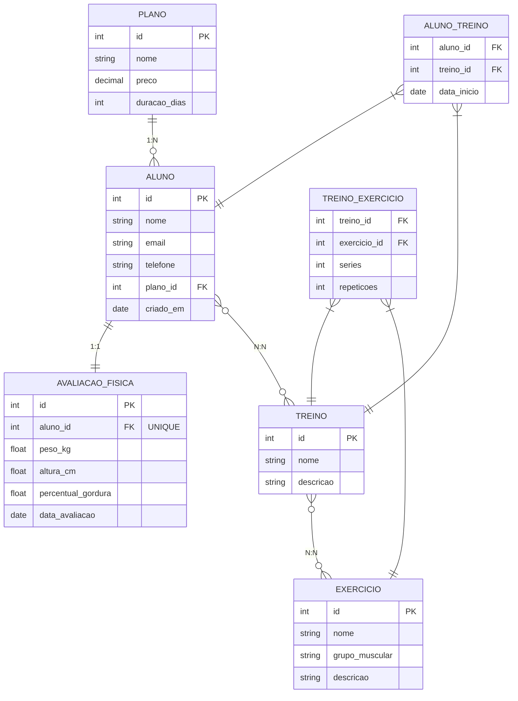

# Modelagem do Banco de Dados — Sistema de Gestão de Academia

## Entidades

- **Aluno**
- **Plano**
- **Treino**
- **Exercício**
- **Avaliação Física**

## Relacionamentos

- **1:1** — Aluno ↔ Avaliação Física (cada aluno possui uma avaliação física atual)
- **1:N** — Plano → Aluno (um plano pode ter vários alunos)
- **N:N** — Treino ↔ Exercício (via tabela `treino_exercicio`)
- **N:N** — Aluno ↔ Treino (via tabela `aluno_treino`, com atributo `data_inicio`)

## Diagrama ER

